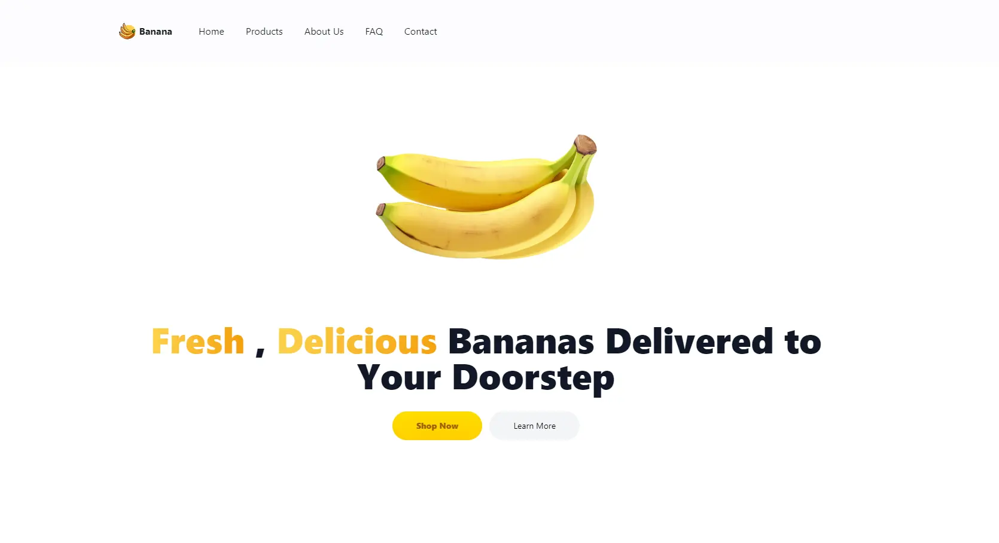

# Banana Shop Project

Welcome to the Banana Shop Project! This is a web application designed to help you buy the freshest bananas online. The project is built using modern web development tools and frameworks to ensure a fast, responsive, and user-friendly experience.

## Stack

This project is built using the following technologies:

- **Vite**: For fast and optimized development build.
- **React**: For building the user interface.
- **Node.js**: For the backend server.
- **NextUI**: For modern and customizable UI components.

## Preview



## Demo

Check out the live demo of the project [here](https://nibobanana.netlify.app).

## Features

| Feature         | Status         |
| --------------- | -------------- |
| Landing Page    | ✅ Done        |
| Page Route      | ✅ Done        |
| Dashboard       | ❌ Undone      |
| Admin Dashboard | 🚧 In Progress |
| Cart Basket     | ❌ Undone      |

## Configuration and Data

### Configuration Files

- **`src/config/site.ts`**: Contains the site configuration such as site name, description, navigation items, and social media links. Edit this file to update site-wide settings.

  ```typescript
  export const siteConfig = {
    name: "Banana Shop",
    description: "The best place to buy fresh bananas online.",
    navItems: [
      { label: "Home", href: "/" },
      { label: "Shop", href: "/shop" },
      { label: "About Us", href: "/about" },
      { label: "FAQ", href: "/faq" },
      { label: "Contact", href: "/contact" },
    ],
    navMenuItems: [
      { label: "Profile", href: "/profile" },
      { label: "Dashboard", href: "/dashboard" },
      { label: "Projects", href: "/projects" },
      { label: "Team", href: "/team" },
      { label: "Calendar", href: "/calendar" },
      { label: "Settings", href: "/settings" },
      { label: "Help & Feedback", href: "/help-feedback" },
      { label: "Logout", href: "/logout" },
    ],
    links: {
      github: "https://github.com/banana-shop",
      twitter: "https://twitter.com/banana_shop",
      instagram: "https://instagram.com/banana_shop",
      facebook: "https://facebook.com/banana_shop",
    },
  };
  ```

- **`src/config/product.ts`**: Contains the product configuration and data. Edit this file to update the product details.

  ```typescript
  export const productList = [
    {
      title: "Cavendish Banana",
      img: "/img/products/fruit-1.webp",
      price: "$1.50",
    },
    { title: "Red Banana", img: "/img/products/fruit-1.webp", price: "$2.00" },
    { title: "Plantain", img: "/img/products/fruit-1.webp", price: "$3.00" },
    {
      title: "Burro Banana",
      img: "/img/products/fruit-1.webp",
      price: "$2.50",
    },
    {
      title: "Blue Java Banana",
      img: "/img/products/fruit-1.webp",
      price: "$3.50",
    },
    {
      title: "Manzano Banana",
      img: "/img/products/fruit-1.webp",
      price: "$2.20",
    },
    { title: "Pisang Raja", img: "/img/products/fruit-1.webp", price: "$4.00" },
    {
      title: "Apple Banana",
      img: "/img/products/fruit-1.webp",
      price: "$2.80",
    },
  ];
  ```

## Cloning the Project

To clone this project, follow these steps:

1. Open your terminal or command prompt.
2. Run the following command to clone the repository:

   ```bash
   git clone https://github.com/yourusername/banana-shop.git
   ```

3. Navigate to the project directory:

   ```bash
   cd banana-shop
   ```

4. Install the dependencies:

   ```bash
   npm install
   ```

5. Run the development server:

   ```bash
   npm run dev
   ```

The application should now be running on `http://localhost:3000`.

## Collaborating with Me

I welcome collaboration on this project! Here's how you can get involved:

1. **Fork the repository**: Click the "Fork" button at the top right of the repository page on GitHub.
2. **Clone your fork**: Use the cloning instructions above, but clone your forked repository.
3. **Create a new branch**:

   ```bash
   git checkout -b feature/your-feature-name
   ```

4. **Make your changes**: Work on your feature, fix bugs, or improve the documentation.
5. **Commit your changes**:

   ```bash
   git add .
   git commit -m "Add a brief message about your changes"
   ```

6. **Push to your fork**:

   ```bash
   git push origin feature/your-feature-name
   ```

7. **Create a pull request**: Go to the original repository on GitHub and click the "New Pull Request" button.

Please make sure to follow the project's code style and write clear commit messages.

Thank you for your interest in collaborating on the Banana Shop Project! Together, we can make it even better.
